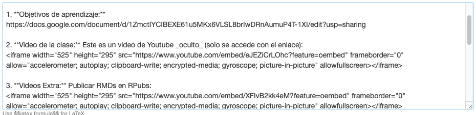
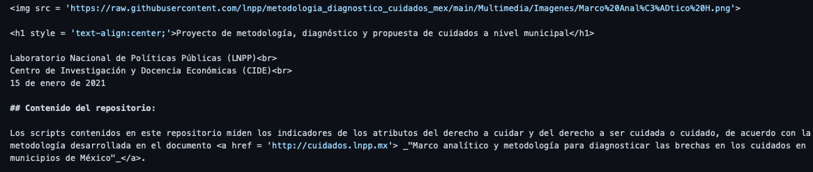
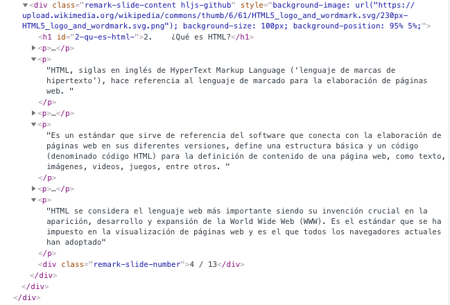
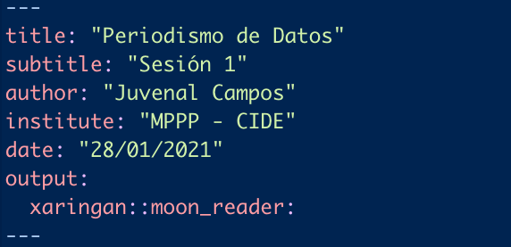
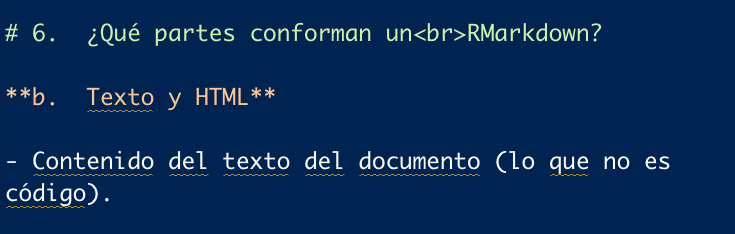
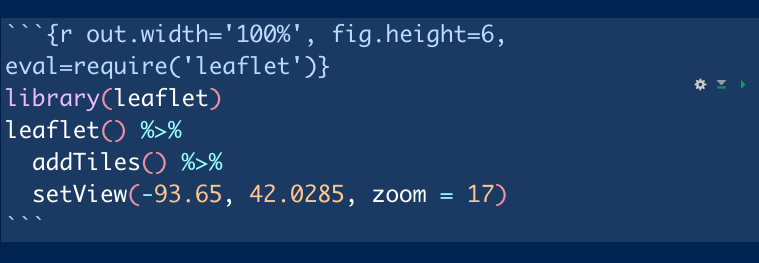

class: inverse, center
background-image: url(bg.png)
background-size: contain

<style>

.piePagina{
  color:gray;
  size:15;
  text-align:center;
}

</style>

<br><br><br><br><br><br><br>
# Periodismo de Datos - Sesión 1
## Introducción a RMarkdown
<br><br><br>
<b style = 'color:black; font-size:25px'>Jorge Juvenal Campos Ferreira</b><br>
<b style = 'color:black;'>Laboratorio Nacional de Políticas Públicas</b><br>
<b style = 'color:black;'>CIDE - LNPP</b><br>
<b style = 'color:black;'>Enero, 2021</b><br>

---
# Objetivos de Aprendizaje

1. Entender la sintaxis básica de Markdown y su uso como una versión simplificada del HTML para generar páginas.

2. Aprender a incluir texto y texto con formato especial en RMarkdown (a través de `HTML` y `CSS`).

3. Aprender a incluir código y las maneras de incluir código en RMarkdown: 

  - Cuando se muestra y se ejecuta, (óptimo para tutoriales).

  - Cuando no se muestra y se ejecuta (`echo = FALSE`), (óptimo para artículos que incluyan gráficas o widgets).

  - Cuando se muestra y no se ejecuta (`eval = FALSE`), (bueno para tutoriales, especialmente en código que no puede ser reproducible o en donde solo queremos mostrar la sintaxis). 

4. Aprender la sintaxis para incluir **imágenes y videos** en una página de Markdown. ([Ver enlace](https://rpubs.com/Juve_Campos/ImagenesyMultimediaEnRmarkdown))

5. Aprender el proceso a seguir para la publicación de una página en RPubs y para subir el código a un repositorio de Github. ([Ver enlace](https://www.youtube.com/watch?v=XFIvB2kk4eM))

---
background-image: url(https://upload.wikimedia.org/wikipedia/commons/thumb/4/48/Markdown-mark.svg/250px-Markdown-mark.svg.png)
background-size: 100px
background-position: 95% 5%

#1.	¿Qué es Markdown? 

Markdown es un *lenguaje de marcado ligero* (ojo, no es lenguaje de programación 👀) creado por John Gruber, el cual **trata de conseguir la máxima legibilidad y facilidad de publicación tanto en su forma de entrada como de salida**, inspirándose en muchas convenciones existentes para marcar mensajes de correo electrónico usando texto plano. 

Se distribuye bajo licencia BSD y se distribuye como plugin (o al menos está disponible) en **diferentes sistemas de gestión de contenidos (CMS)**. 


_Por ejemplo, Piazza o Github utilizan este formato como opcional para trabajar dentro de estas plataformas_.

.pull-left[

  
  
  <p class = piePagina>Fig. 1: Editor de Markdown en Piazza</p>

]

.pull-right[

  
  
  <p class = piePagina>Fig. 2: Editor de Markdown en GitHub</p>

]

---
background-image: url(https://upload.wikimedia.org/wikipedia/commons/thumb/6/61/HTML5_logo_and_wordmark.svg/230px-HTML5_logo_and_wordmark.svg.png)
background-size: 100px
background-position: 95% 5%

# 2.	¿Qué es HTML?

HTML, siglas en inglés de HyperText Markup Language (‘**lenguaje de marcas de hipertexto**’ ojo, no es lenguaje de programación 👀), hace referencia al lenguaje de marcado para la elaboración de páginas web.

Es un **estándar** que sirve **para definir una estructura básica y un código (denominado código HTML) para la definición de contenido de una página web**, como texto, imágenes, videos, juegos, entre otros. 


<p style = "text-align:center;">

</p>
---
background-image: url(https://upload.wikimedia.org/wikipedia/commons/thumb/6/61/HTML5_logo_and_wordmark.svg/230px-HTML5_logo_and_wordmark.svg.png)
background-size: 100px
background-position: 95% 5%

# Analogía de los lenguajes de la web.

<p style='text-align:center;'>

</p>


En este curso, el cerebro será **R** en vez de JS.

---
background-image: url(https://raw.githubusercontent.com/rstudio/hex-stickers/master/PNG/rmarkdown.png)
background-size: 100px
background-position: 95% 5%

# 3.	¿Qué es RMarkdown? 

RMarkdown es un lenguaje de formato que nos permite revelar nuestros descubrimientos provenientes de un análisis de datos a través de la construcción de documentos PDF, HTML o incluso, aplicaciones Shiny.

A través de esta (y otras librerías) podemos combinar texto y redacción junto a código ejecutable para generar documentos que se aprovechen las bondades de ambos mundos: la redacción para documentar un proceso, dar un contexto o una explicación, o contar una historia o un reportaje y además, el código que nos va a permitir explicar un procedimiento o generar una tabla o una visualización para hacer más poderoso el mensaje que se desea transmitir. 

<br>

<p class = 'piePagina'><b>Pro-tip:</b>  Se les recomienda que para tomar los apuntes de las próximas sesiones del curso (o de cualquier curso que involucre código de R), utilicen esta librería para generar sus apuntes y tener referencias a las cuales acudir en el futuro. </p>


---
background-image: url(https://raw.githubusercontent.com/rstudio/hex-stickers/master/PNG/rmarkdown.png)
background-size: 100px
background-position: 95% 5%

# 4.	¿Por qué es importante saber RMarkdown? 

**Algunas razones:** 

-	Es parte importante del curso y el profesor quiere que lo aprendan. 😉

-	Es una gran herramienta para poder aprender R y tomar apuntes que también requieran anotar código. 

-	Nos permite compartir nuestros códigos de forma limpia y ordenada (_no copien sus códigos a Word_). 

-	Permiten generar reportes de código reproducible, combinando nuestro código bien escrito con nuestra bonita redacción 😊. 

-	Permiten generar y publicar páginas web de manera rápida. 

-	Es una excelente librería para aprender fundamentos de programación web.

**Entre otras razones.**

---
background-image: url(https://raw.githubusercontent.com/rstudio/hex-stickers/master/PNG/rmarkdown.png)
background-size: 100px
background-position: 95% 5%

# 5.	Formatos de salida

RMarkdown nos permite crear algunos de los siguientes tipos de formatos: 

-	Páginas HTML<br><br>
-	Documentos en *.pdf (en conjunto con una distribución de LATEX). <br><br>
-	Documentos de Word.<br><br>
-	Presentaciones (Xaringan).<br><br>
-	Blogs utilizando la librería blogdown.<br><br>
-	Libros electrónicos con formato bookdown. <br><br>

**Entre otros.**

---
background-image: url(https://raw.githubusercontent.com/rstudio/hex-stickers/master/PNG/rmarkdown.png)
background-size: 100px
background-position: 95% 5%

# 6.	¿Qué partes conforman un<br>RMarkdown? 

**a.	Encabezado YAML**

-	Regula los parámetros con los que va a funcionar el documento. 



---
background-image: url(https://raw.githubusercontent.com/rstudio/hex-stickers/master/PNG/rmarkdown.png)
background-size: 100px
background-position: 95% 5%

# 6.	¿Qué partes conforman un<br>RMarkdown? 

**b.	Texto y HTML**

-	Contenido del texto del documento (lo que no es código). 



---
background-image: url(https://raw.githubusercontent.com/rstudio/hex-stickers/master/PNG/rmarkdown.png)
background-size: 100px
background-position: 95% 5%

# 6.	¿Qué partes conforman un<br>RMarkdown? 

**c.	Chunk de código. **

-	Sección del documento que va a ejecutar código. 



---
background-image: url(https://raw.githubusercontent.com/rstudio/hex-stickers/master/PNG/rmarkdown.png)
background-size: 100px
background-position: 95% 5%

# 6.	¿Qué partes conforman un<br>RMarkdown? 

```{r out.width='100%', fig.height=4, eval=require('leaflet')}
# Ejecutando dicho codigo
library(leaflet)
leaflet() %>% 
  addTiles() %>% 
  setView(-93.65, 42.0285, zoom = 17)
```

---
background-image: url(https://raw.githubusercontent.com/rstudio/hex-stickers/master/PNG/rmarkdown.png)
background-size: 100px
background-position: 95% 5%

# **7.	¿Cómo puedo introducir texto? **


  a.	Texto normal (escribiendo texto normal).
<br><br>
  b.	Texto en Negritas (encerrando el texto entre dos asteríscos `"*"`).
<br><br>
  c.	Texto en itálicas (encerrando el texto entre dos guiones bajos `"_"`)
<br><br>
  d.	Texto de código que no vayamos a ejecutar (encerrando el código entre tres backsticks `"```"`)
<br><br>
  e.	Enlaces (encerrando el texto del enlace entre corchetes `[]` y la url de destino entre paréntesis `()`
<br><br>
  f.	Texto con estilos (CSS) ( _ver tutorial debajo_)
<br><br>
  g.	Imágenes ( _ver tutorial debajo_)
<br><br>
  h.	Código HTML ( _ver tutorial debajo_)
<br><br>

Para ver más tags útiles de HTML, revisar el siguiente [tutorial](https://rpubs.com/Juve_Campos/htmlEnR).


---
background-image: url(https://raw.githubusercontent.com/rstudio/hex-stickers/master/PNG/rmarkdown.png)
background-size: 100px
background-position: 95% 5%

# **8.	¿Cómo puedo introducir código de R? **

a.	Chunk de código
i.	Nombre del chunk
ii.	Opciones del chunk
    1.	Opción para ocultar/mostrar el código
    2.	Opción para no ejecutar el código
    3.	Opción para regular el tamaño de las figuras
    4.	Opciones para no mostrar mensajes de consola

---
background-image: url(https://raw.githubusercontent.com/rstudio/hex-stickers/master/PNG/rmarkdown.png)
background-size: 100px
background-position: 95% 5%

# **9.	Publicación**

La publicación consiste en subir el HTML resultante a un servidor web para que esta página se encuentre disponible para el público en general. Hay múltiples maneras de hacer esto, a continuación se te presentan dos alternativas sin costo: 
  
  a.	Publicación en RPubs. (Ver este [video](https://www.youtube.com/channel/UCICkEQr2pAwU2hyw6xoBzAw))
  
_Este es el servicio de RStudio para subir HTMLs provenientes de RMarkdown. Es rápido (solo aprietas un botón, das nombre, descripción y la extensión de la página y ya) y el más sencillo._ 
  
  b.	Publicación en Github Pages. 

_Este servicio es para subir cualquier página a una dirección de Github. Hay que tener una cuenta y un repositorio con la opción de github pages activado, pero igualmente es sencillo de utilizar._

---
background-image: url(https://raw.githubusercontent.com/rstudio/hex-stickers/master/PNG/rmarkdown.png)
background-size: 100px
background-position: 95% 5%

# Videos:

Algunos videos complementarios_ 

**-	Publicar documentos de R a RPubs.** https://www.youtube.com/channel/UCICkEQr2pAwU2hyw6xoBzAw

**-	Publicar documentos en Github Pages**
En proceso

**-	Publicar documentos en Netlify**
En proceso

**-	Creación de un Blog en Blogdown**
En proceso

---
background-image: url(https://raw.githubusercontent.com/rstudio/hex-stickers/master/PNG/rmarkdown.png)
background-size: 100px
background-position: 95% 5%

# **Material**

-	Presentación curso Vis2020: https://rpubs.com/Juve_Campos/rmarkdown

-	RMarkdown the definitive guide https://bookdown.org/yihui/rmarkdown/

-	RMarkdown Cookbook https://bookdown.org/yihui/rmarkdown-cookbook/

-	Authoring Bookdown https://bookdown.org/yihui/bookdown/

-	Galería. RMarkdown from RStudio. https://rmarkdown.rstudio.com/gallery.html

-	Creating sites with blogdown. https://bookdown.org/yihui/blogdown/

-	Blog de Yihui Xie: https://yihui.org/en/

-	Presentaciones Xaringan: https://bookdown.org/yihui/rmarkdown/xaringan.html

-	Pimp my .RMD: https://holtzy.github.io/Pimp-my-rmd/

-	RMarkdown cheatsheet: https://rstudio.com/wp-content/uploads/2015/02/rmarkdown-cheatsheet.pdf

- Why RMarkdown: https://rmd4sci.njtierney.com/why-rmarkdown.html_


---
background-image: url(https://raw.githubusercontent.com/rstudio/hex-stickers/master/PNG/rmarkdown.png)
background-size: 100px
background-position: 95% 5%
class: center, middle

# Gracias

Diapositivas creadas con el paquete [**xaringan**](https://github.com/yihui/xaringan) utilizando RMarkdown.

